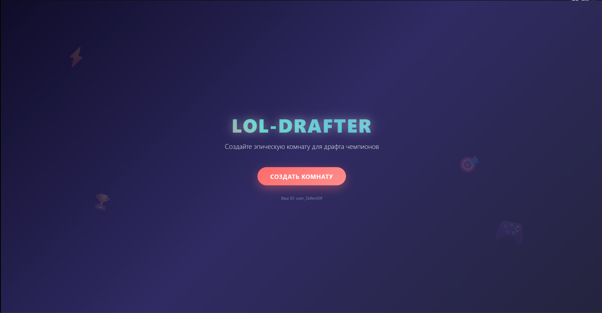
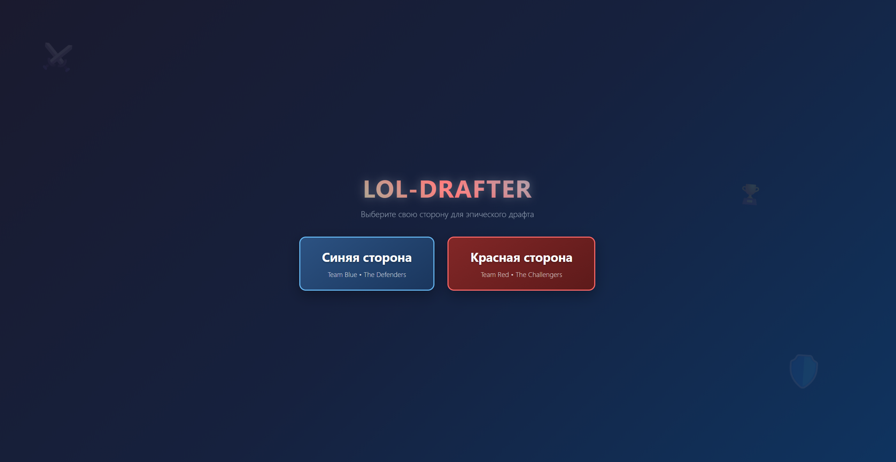
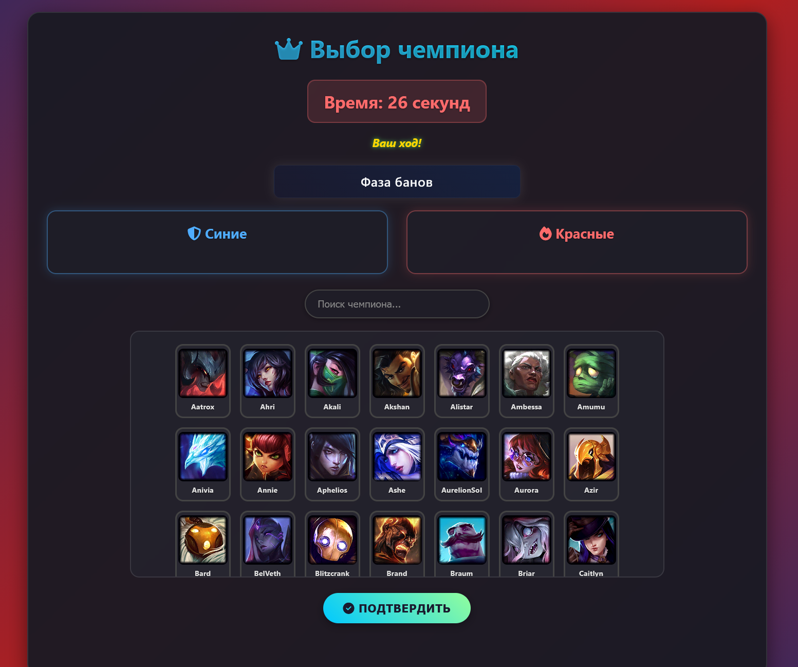

# 🎮 LoL Draft Simulator

## Название и краткое описание

**LoL Draft Simulator** — это интерактивный веб-инструмент, который воссоздаёт официальный драфт-процесс из игры *League of Legends*. Хотите потренировать стратегию перед турниром, согласовать состав с друзьями или просто поиграть в «умный» драфт? Наш симулятор позволяет двум командам (Синей и Красной) поочерёдно банить и пикать чемпионов.

Проект решает реальную проблему — отсутствие удобного, бесплатного и не требующего регистрации инструмента для совместного драфта вне игры. Всё, что нужно — ссылка и браузер!

## Стек технологий

- **Backend**: Python 3.11, Django 5.0
- **Frontend**: HTML5, CSS3, Vanilla JavaScript (без фреймворков)
- **База данных**: SQLite (встроенная, подходит для локального и контейнерного развёртывания)
- **API**: [Riot Games Data Dragon (DDragon)](https://ddragon.leagueoflegends.com/) — для получения актуальных данных о чемпионах
- **Сбор статики**: `django.contrib.staticfiles`
- **Сервер**: Gunicorn (в продакшене), встроенный сервер Django (локально)
- **Контейнеризация**: Docker

## Демонстрация

### Главная страница — создание комнаты
!

### Страница выбора стороны - выбор стороны


### Страница драфта - весь процесс драфта


## Установка и запуск

Чтобы запустить проект локально, выполните следующие шаги:

1. **Клонируйте репозиторий**
   ```bash
   git clone https://github.com/V4n1sh795/LoL-Drafter.git
   cd LoL-Drafter
2. **Запустите скрипт**
    ```bash
    ./run.sh # Linux
    # На Windows просто нажимаем дважды на run.bat 
## Ссылка на деплой
Рабочая версия проекта https://lol-drafter.onrender.com/
